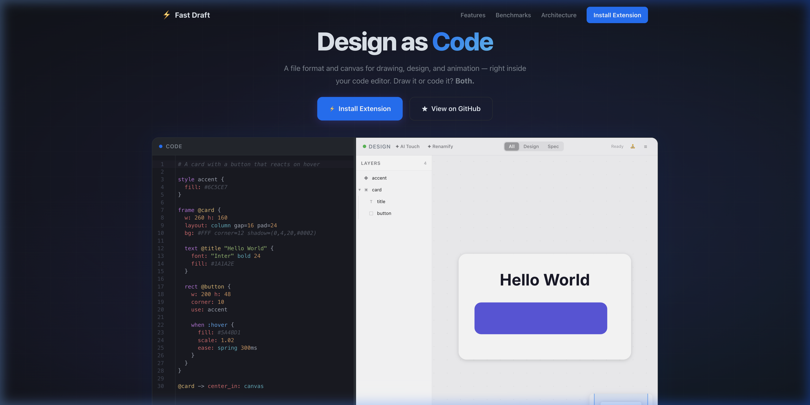

# Fast Draft

> **Design as Code.** A text format and live canvas for drawing, design, and animation — right inside your code editor.

<p align="center">
  <a href="https://fast-draft.com"><strong>🌐 Try the Live Playground</strong></a> · 
  <a href="https://marketplace.visualstudio.com/items?itemName=khangnghiem.fast-draft"><strong>⚡ Install Extension</strong></a> · 
  <a href="https://github.com/khangnghiem/fast-draft"><strong>★ GitHub</strong></a>
</p>

<p align="center">
  
</p>

**Two modes, one file:**

- 🤖 **Code Mode** — LLMs and coding agents read, write, and reason about `.fd` text directly. ~6× fewer tokens than Excalidraw JSON, so entire UIs fit in a single prompt.
- 🎨 **Canvas Mode** — designers drag, resize, and draw on a fast, GPU-powered canvas inside VS Code, Cursor, or Zed. No code knowledge needed.

Changes in one mode instantly appear in the other.

---

## See It in Action

A card component with a hover animation — in 20 lines:

```
# A card with a button that reacts on hover

style accent {
  fill: #6C5CE7
}

frame @card {
  layout: column gap=16 pad=24
  bg: #FFF corner=12 shadow=(0,4,20,#0002)

  text @title "Hello World" {
    font: "Inter" 600 24
    fill: #1A1A2E
  }

  rect @button {
    w: 200 h: 48
    corner: 10
    use: accent

    when :hover {
      fill: #5A4BD1
      scale: 1.02
      ease: spring 300ms
    }
  }
}

@card -> center_in: canvas
```

---

## Why Fast Draft?

| Benefit                        | How                                                                              |
| ------------------------------ | -------------------------------------------------------------------------------- |
| **AI-friendly**                | Text DSL ~6× smaller than Excalidraw JSON — LLMs can read and write entire UIs   |
| **Version-control ready**      | Plain text — `git diff`, `git merge`, code review all work naturally             |
| **Design + specs in one file** | Attach requirements, status, and acceptance criteria directly to visual elements |
| **No context switching**       | Design and code live side-by-side in your editor                                 |

## Features

- ↔️ **Two-way sync** — edit code or canvas, the other updates in <16ms
- 🤖 **AI Touch** — press ⌘I to improve designs with AI (supports 5 providers)
- 📋 **Spec blocks** — attach requirements, status, and acceptance criteria directly to shapes
- ✏️ **Sketchy rendering** — hand-drawn mode with wobbly, organic lines
- 👆 **Touch & gestures** — two-finger pan, pinch-to-zoom, Apple Pencil support
- 🎬 **Drag-and-drop animations** — drag a shape onto another to add hover/press effects

## AI Touch

One button, context-adaptive AI. All modes go through a single `/api/ai` endpoint.

| Action | What Happens | Credits |
|--------|-------------|---------|
| ✦ AI Touch (with selection) | Phase 1: refine styling + naming → Phase 2: scoped review with score | 2 |
| ✦ AI Touch (no selection) | Full-document design review | 1 |
| ☰ → Full Design Review | Same as above | 1 |
| ✦ Renamify | Rename anonymous IDs to semantic names | 1 |

### Model Configuration

Models are configured via **Cloudflare environment variables** (Dashboard → Workers & Pages → fast-draft → Settings → Environment variables):

| Variable | Purpose | Default |
|----------|---------|---------|
| `AI_MODEL_FAST` | refine + renamify | `@cf/google/gemma-3-12b-it` |
| `AI_MODEL_QUALITY` | review | `@cf/google/gemma-3-12b-it` |
| `AI_DAILY_LIMIT` | calls/day/IP | `20` |

**Recommended production models:**
```
AI_MODEL_FAST=@cf/meta/llama-3.1-8b-instruct
AI_MODEL_QUALITY=@cf/meta/llama-3.3-70b-instruct-fp8-fast
```

### Admin Model Override

Override the model per browser session using a URL parameter:

```
https://fast-draft.com/playground?ai_model=llama-70b
```

| Alias | Model | Size |
|-------|-------|------|
| `llama-1b` | Llama 3.2 1B | Tiny, ultra-fast |
| `llama-3b` | Llama 3.2 3B | Small, fast |
| `llama-8b` | Llama 3.1 8B | Medium, balanced |
| `llama-8b-fast` | Llama 3.1 8B Fast | Medium, speed-optimized |
| `llama-70b` | Llama 3.3 70B FP8 | Large, highest quality |
| `llama-scout` | Llama 4 Scout 17B MoE | Multimodal, 16 experts |
| `gemma-12b` | Gemma 3 12B | Medium, 128K context |
| `qwen-coder` | Qwen 2.5 Coder 32B | Code-specialized |
| `qwen-30b` | Qwen 3 30B MoE | MoE, reasoning |
| `qwq-32b` | QwQ 32B | Reasoning, R1-class |
| `mistral-24b` | Mistral Small 3.1 24B | Vision + 128K context |
| `gpt-20b` | GPT-OSS 20B | Low latency |
| `gpt-120b` | GPT-OSS 120B | High reasoning |
| `nemotron-120b` | Nemotron 3 Super 120B | Multi-agent |
| `deepseek-r1` | DeepSeek R1 Distill 32B | Reasoning champion |
| `granite` | Granite 4.0 Micro | Agentic, function calling |
| `glm-flash` | GLM 4.7 Flash | 131K context, fast |

The review panel footer shows which model produced the result.

## Built-In Notes

Attach notes and requirements directly to visual elements:

```
rect @login_btn {
  note {
    Primary CTA — triggers login API call
    - [ ] disabled state when fields empty
    - [ ] loading spinner during auth
  }
  w: 280 h: 48
  fill: #6C5CE7 corner=10
}
```

| What you write     | What it means                                          |
| ------------------ | ------------------------------------------------------ |
| `note "text"`      | A short inline note on the element                     |
| `note { markdown }` | Multi-line markdown (checklists, headings, bullets)   |

## Editor Support

| Editor           | Syntax | LSP | Canvas |
| ---------------- | :----: | :-: | :----: |
| VS Code / Cursor |   ✅   |  —  |   ✅   |
| Zed              |   ✅   | ✅  |   —    |
| Neovim           |   ✅   |  —  |   —    |
| Sublime Text     |   ✅   |  —  |   —    |
| Helix            |   ✅   |  —  |   —    |
| Emacs            |   ✅   |  —  |   —    |

## Platform Roadmap

| Platform                  | Status         |
| ------------------------- | -------------- |
| VS Code / Cursor IDE      | 🟡 In progress |
| Zed                       | 🟢 Published   |
| Neovim / Helix / Sublime  | 🟢 Syntax only |
| Web playground            | 🟢 Live        |
| Desktop (macOS/Win/Linux) | ⬜ Planned     |
| iOS / Android             | ⬜ Planned     |

## Contributing

See [CONTRIBUTING.md](CONTRIBUTING.md) for architecture, crate structure, build instructions, and development setup.

## License

MIT — see [LICENSE](LICENSE)
